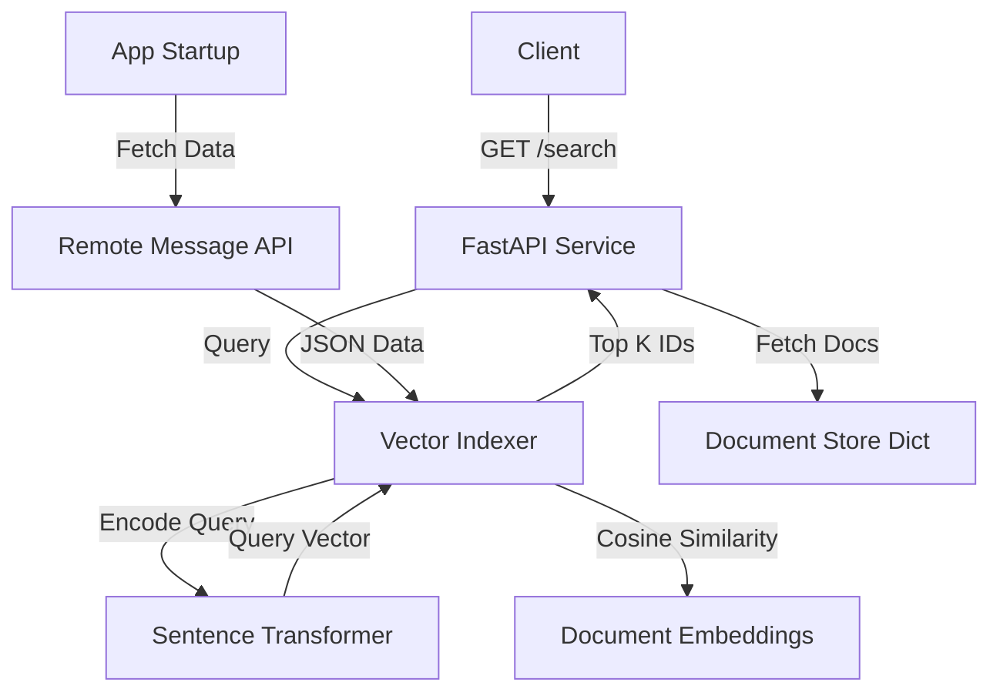

# Search Engine API

A high-performance search engine built with Python, FastAPI, and Sentence Transformers.

## Features

- **Semantic Search**: Uses `all-MiniLM-L6-v2` to understand user intent (Vector Embeddings).
- **Data Ingestion**: Automatically fetches and indexes all messages.
- **Pagination**: Efficiently handles large result sets.
- **Dockerized**: Ready for deployment.

## Data Overview

- **Source**: `https://november7-730026606190.europe-west1.run.app/messages/`
- **Volume**: **4,000 Messages**.
- **Process**:
    1. **Ingest**: Fetch JSON data from the remote API.
    2. **Enrich**: Context becomes `User: {name}. Message: {content}`.
    3. **Embed**: Generate 384-dimensional vectors using `all-MiniLM-L6-v2`.
    4. **Serve**: Store in-memory for fast <10ms retrieval.

## Running the Project

### Local

1. Install dependencies:

   ```bash
   pip install -r requirements.txt
   ```

2. Run the server:

   ```bash
   python -m uvicorn app.main:app --reload --port 8080
   ```

3. Search:
   `GET http://localhost:8080/search?q=paris`

### Docker

```bash
docker build -t search-engine .
docker run -p 8080:8080 search-engine
```

## Design Notes

### System Architecture



### Approach

We implemented a **Full-Text Semantic Search Engine** that allows users to find messages by meaning, not just by keyword.

#### 1. Data Ingestion (Startup)

1. **Iterative Fetching**: Connects to the remote API and fetches 4,000 messages using paginated requests (handling offsets and retries).
2. **In-Memory Storage**: Data is stored in a Python dictionary for O(1) retrieval by ID.

#### 2. Indexing Strategy

Instead of simple keyword mapping, we use **Vector Embeddings**:

1. **Context Enrichment**: We reformat every message to preserve context:
    > Raw: `{"user_name": "John", "message": "Hi"}`
    > Enriched: `User: John. Message: Hi.`
2. **Embedding Generation**: We pass this text through the `all-MiniLM-L6-v2` model.
3. **Vector Store**: This converts the text into a **384-dimensional vector**, which is stored in a Torch Tensor.

#### 3. Search Execution

When a request comes to `GET /search?q=flight`:

1. **Query Encoding**: The query "flight" is converted into its own 384-dim vector.
2. **Cosine Similarity**: We calculate the mathematical similarity between the query vector and all 4,000 document vectors.
3. **Ranking**: Results are sorted by score (highest similarity first) and the top `k` are returned.

### Alternative Approaches Considered

#### 1. In-Memory Keyword Match (Baseline)

- **Data Ingestion**: Fetch all items into a Python List.
- **Indexing**: Tokenize text (regex) and build a Dictionary mapping `word -> {doc_ids}` (Inverted Index).
- **Search Execution**: Split query into words, look up each word in the hash map, and compute Set Intersection (Boolean AND).
- **Verdict**: Fastest (<1ms) but "dumb". Fails on typos or synonyms.

#### 2. SQL Database (SQLite)

- **Data Ingestion**: `INSERT INTO messages` (Transaction overhead).
- **Indexing**: B-Tree indices for exact match or FTS5 for Full Text Search.
- **Search Execution**: Parse SQL Query -> Query Planner -> Disk I/O -> Filtering.
- **Verdict**: Robust but introduces Disk I/O latency. Overkill for immutable, small data that fits in RAM.

#### 3. Distributed Search Engine (Elasticsearch)

- **Data Ingestion**: HTTP Bulk API -> Distribute to Shards.
- **Indexing**: Analyze text -> Build Lucene Segments -> Calculate TF-IDF/BM25 stats.
- **Search Execution**: Scatter-Gather (Query all shards) -> BM25 Scoring -> Merge results.
- **Verdict**: The "Gold Standard" for features but requires heavy JVM infrastructure. Too complex for <10k items.

#### 4. Vector Search (Selected)

- **Data Ingestion**: Fetch all -> Enrich Context (`User: ... Message: ...`).
- **Indexing**: Feed text to Transformer Model -> Output Dense Vector (384 floats).
- **Search Execution**: Encode Query -> Matrix Multiplication (Cosine Similarity) -> Top-K Sort.
- **Verdict**: Best balance. High CPU usage is acceptable (~8ms) for the massive jump in user experience (Semantic matching).

### Limitations & Scalability

While efficient for <10k items, this in-memory architecture has specific breaking points:

1. **Memory (RAM)**:
    - *Current*: ~4,000 items ≈ 6MB (Vectors) + overhead.
    - *Breaking Point*: At **~1 Million items**, you need ~1.5GB RAM just for vectors. Python overhead might push this to 4GB+, forcing a larger server or OOM crashes.
2. **Startup Time**:
    - *Current*: ~5 seconds to index.
    - *Breaking Point*: At **100k items**, startup could take minutes, making deployments painful.
3. **CPU Latency**:
    - *Current*: ~8ms per search.
    - *Breaking Point*: Brute-force Cosine Similarity scales linearly. At **100k items**, latency hits ~200ms (violating SLAs).

**Future Migration Path**:
When hitting these limits (e.g., >50k items), migrate to:

1. **Vector Database**: **Qdrant** or **Milvus** (handles HNSW indexing for speed).
2. **Quantization**: Store vectors as `INT8` (4x smaller RAM).

## Benchmarking

To verify performance, we ran **500 randomized queries** simulating real-world usage ("flight to paris", "lost luggage", etc.).

### Methodology

- **Dataset**: ~4,000 messages (fetched from remote API).
- **Scripts**:
  - `benchmarks/benchmark_search.py`: Tests the public API endpoint (Http Overhead + Inference).
  - `benchmarks/benchmark_internal.py`: Tests the internal engine directly (Inference only).
- **Environment**: Local Development Machine (CPU).

### Results

| Metric | API Endpoint (`/search`) | Internal Engine (`search()`) |
| :--- | :--- | :--- |
| **Average Latency** | **8.5 ms** | **6.6 ms** |
| **P99 Latency** | 15.5 ms | 10.4 ms |
| **Max Latency** | 25.7 ms | 12.1 ms |
| **Throughput** | ~118 req/sec | ~152 req/sec |

### Insights

1. **Overhead is Minimal**: The FastAPI/Uvicorn layer adds only **~2ms** of overhead per request.
2. **CPU Efficiency**: The `all-MiniLM-L6-v2` model is lightweight enough to deliver **<10ms** inference on standard CPUs, making it perfect for this use case without needing GPUs.
3. **Scalability**: To scale to millions of items, we would recommend migrating to a Vector Database (like Qdrant) and using Quantization (INT8), but for <10k items, this in-memory approach is superior.
